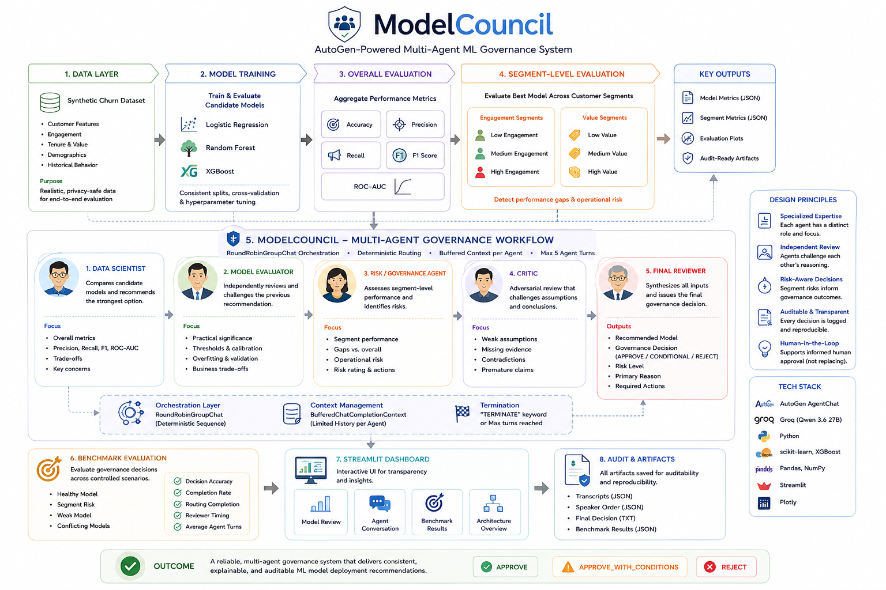
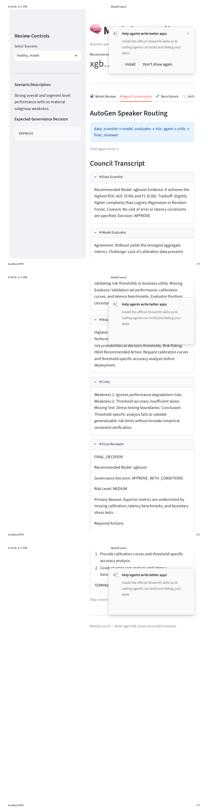
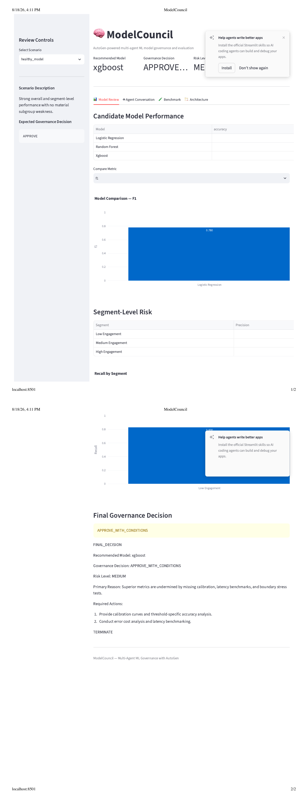

# ModelCouncil

<p align="center">
  <b>AutoGen-Powered Multi-Agent ML Governance System</b>
</p>

<p align="center">
  Model Evaluation • Segment Risk • Independent Review • Adversarial Critique • Auditable Decisions
</p>

<p align="center">
  <code>AutoGen</code> •
  <code>Groq</code> •
  <code>Qwen</code> •
  <code>XGBoost</code> •
  <code>scikit-learn</code> •
  <code>Streamlit</code>
</p>

---

# STAR Project Story

## S — Situation

Machine learning model selection often ends with a comparison of aggregate metrics such as:

- Precision
- Recall
- F1
- ROC-AUC

However, the model with the strongest aggregate metric is not automatically the safest model to deploy.

Before production approval, ML teams may also need to understand:

- Whether model performance degrades for specific customer segments
- Whether differences between candidate models are practically meaningful
- Whether calibration or threshold tuning is still required
- Whether operational or customer risks remain unresolved
- Whether the available validation evidence is sufficient for deployment
- Whether a model should be approved, conditionally approved, or rejected

This creates a governance problem:

> How can multiple perspectives on model quality, validation, risk, and deployment readiness be systematically incorporated into the model approval process?

ModelCouncil was built to explore this problem using a specialized multi-agent AI review workflow.

---

## T — Task

The goal was to build a **pre-production ML governance and decision-support layer** that sits between model evaluation and human deployment approval.

Given multiple candidate ML models and their overall and segment-level performance, ModelCouncil should:

1. Identify the strongest candidate model.
2. Independently challenge the model-selection recommendation.
3. Detect segment-level weaknesses hidden by aggregate metrics.
4. Surface unresolved model and operational risks.
5. Adversarially critique assumptions and missing evidence.
6. Produce an auditable final governance recommendation.

The final recommendation must be one of:

```text
APPROVE
APPROVE_WITH_CONDITIONS
REJECT
```

The system is designed as a **decision-support layer**, not as a replacement for human model approval.

---

# A — Action

## 1. Built the ML Evaluation Pipeline

A synthetic customer churn dataset is generated and used to train three candidate models:

```text
Logistic Regression
Random Forest
XGBoost
```

Each model is evaluated using:

```text
Accuracy
Precision
Recall
F1
ROC-AUC
```

A representative run produced approximately:

| Model | Accuracy | Precision | Recall | F1 | ROC-AUC |
|---|---:|---:|---:|---:|---:|
| Logistic Regression | 0.845 | 0.843 | 0.557 | 0.671 | 0.860 |
| Random Forest | 0.908 | 0.923 | 0.736 | 0.819 | 0.961 |
| XGBoost | 0.909 | 0.905 | 0.759 | 0.826 | 0.960 |

This establishes the initial evidence available to the governance council.

---

## 2. Added Segment-Level Model Evaluation

Aggregate performance can hide localized weaknesses.

To expose these risks, the leading model is also evaluated across:

- Engagement segments
- Customer-value segments

One evaluation identified a substantial recall degradation for the `high_engagement` segment:

```text
Overall XGBoost Recall: ~0.76
High-Engagement Segment Recall: ~0.45
```

This is treated as a **model-risk signal**, not automatically as evidence of algorithmic bias.

The purpose of the segment layer is to make hidden model behavior visible before deployment.

---

## 3. Built a Specialized AutoGen Governance Council

ModelCouncil uses Microsoft AutoGen to coordinate five specialized reviewers.

### Data Scientist

Evaluates candidate models and recommends the strongest current candidate.

Focus:

- Precision
- Recall
- F1
- ROC-AUC
- Model tradeoffs

### Model Evaluator

Acts as an independent reviewer of the Data Scientist's recommendation.

Focus:

- Practical significance
- Threshold selection
- Calibration
- Validation quality
- Overfitting risk
- Business cost tradeoffs

### Risk / Governance Agent

Examines segment-level model behavior.

Focus:

- Weak recall
- Weak precision
- Segment-vs-overall gaps
- Operational risk
- Customer impact

### Critic

Acts as an adversarial reviewer.

Focus:

- Unsupported assumptions
- Contradictions
- Missing experiments
- Premature deployment conclusions

### Final Reviewer

Synthesizes all specialist perspectives and produces the final governance recommendation.

The Final Reviewer outputs:

- Recommended model
- Governance decision
- Risk level
- Primary reason
- Required actions

---

## 4. Implemented Governed Agent Routing

The final workflow uses AutoGen:

```text
RoundRobinGroupChat
```

with the deterministic sequence:

```text
Data Scientist
      ↓
Model Evaluator
      ↓
Risk / Governance Agent
      ↓
Critic
      ↓
Final Reviewer
```

This guarantees that every required governance role participates before a final recommendation is issued.

---

## 5. Designed the Governance Policy

The council applies the following decision policy.

### APPROVE

Used when:

- Overall model performance is strong
- No material segment-level degradation exists
- No critical unresolved deployment risk remains

### APPROVE_WITH_CONDITIONS

Used when:

- The model is generally viable
- Material concerns remain around:
  - Segment performance
  - Thresholding
  - Calibration
  - Validation
  - Business tradeoffs

### REJECT

Used when:

- Overall model performance is inadequate
- Or unresolved model risk makes deployment inappropriate

---

## 6. Optimized Multi-Agent Context and Token Usage

The initial implementation experimented with AutoGen `SelectorGroupChat`, allowing an LLM to dynamically determine the next speaker.

During testing, this exposed several production-style limitations:

- Conversation context accumulated across agent turns
- Speaker-selection calls increased token usage
- Provider TPM limits were reached
- Smaller models occasionally failed to select valid speakers
- Governance workflows required all specialists to participate anyway

The architecture was therefore changed to deterministic governed routing.

ModelCouncil also uses:

```text
BufferedChatCompletionContext
```

to limit the amount of conversation history supplied to each agent.

Additional optimizations include:

- Compact prompts
- Bounded agent turns
- Compact JSON evidence
- Limited conversation history
- Disabled unnecessary reasoning output
- Persisted outputs to avoid unnecessary reruns

This reduced orchestration overhead and made the workflow more predictable.

---

## 7. Built Scenario-Based Agent Evaluation

To evaluate ModelCouncil independently from the underlying churn dataset, four controlled governance scenarios were created.

### Healthy Model

Strong overall and segment-level performance.

Expected decision:

```text
APPROVE
```

### Segment Risk

Strong aggregate performance but significant degradation for a specific customer segment.

Expected decision:

```text
APPROVE_WITH_CONDITIONS
```

### Weak Model

All candidate models perform poorly and recall is inadequate for the use case.

Expected decision:

```text
REJECT
```

### Conflicting Models

One model provides stronger precision while another provides stronger recall, but no business cost function is available.

Expected decision:

```text
APPROVE_WITH_CONDITIONS
```

---

## 8. Evaluated Both Orchestration and Governance Quality

The benchmark measures:

- Governance decision accuracy
- Decision completion rate
- Routing completion rate
- Final reviewer timing
- Average agent turns

This intentionally separates two different questions:

```text
Can the agents reliably complete the governance workflow?
```

from:

```text
Do the agents make the correct governance decision?
```

This distinction became an important part of the evaluation design.

---

## 9. Built an Interactive Streamlit Application

ModelCouncil includes a Streamlit dashboard with four main views:

| View | Purpose |
|---|---|
| **Model Review** | Compare candidate models and inspect segment-level performance |
| **Agent Conversation** | Inspect the complete multi-agent governance discussion |
| **Benchmark** | Evaluate orchestration reliability and decision quality |
| **Architecture** | Understand the end-to-end system design |

Run the application with:

```bash
streamlit run app.py
```

---

## Architecture

<p align="center">
  
</p>

### End-to-End Flow

```text
Synthetic Churn Data
        ↓
ML Training
        ↓
Logistic Regression | Random Forest | XGBoost
        ↓
Overall Model Evaluation
        ↓
Precision | Recall | F1 | ROC-AUC
        ↓
Segment-Level Evaluation
        ↓
AutoGen ModelCouncil
        ↓
Data Scientist
        ↓
Model Evaluator
        ↓
Risk / Governance Agent
        ↓
Critic
        ↓
Final Reviewer
        ↓
APPROVE | APPROVE_WITH_CONDITIONS | REJECT
        ↓
Benchmark Evaluation
        ↓
Streamlit Dashboard
        ↓
Audit Artifacts
```

---

# R — Result

## Product Outcome

ModelCouncil now provides an end-to-end prototype that can:

- Train multiple candidate ML models
- Compare overall model performance
- Evaluate segment-level model risk
- Coordinate five specialized AutoGen reviewers
- Produce a structured governance recommendation
- Persist agent transcripts and decisions for auditability
- Benchmark agent performance across controlled scenarios
- Surface results through an interactive Streamlit application

---

## Orchestration Results

The final governed workflow achieved:

```text
Decision Completion Rate: 100%
Routing Completion Rate: 100%
Final Reviewer Timing Accuracy: 100%
Average Agent Turns: 5
```

Every benchmark scenario completed the complete review sequence:

```text
Data Scientist
→ Model Evaluator
→ Risk Agent
→ Critic
→ Final Reviewer
```

This demonstrated that the orchestration layer could execute the intended governance process reliably.

---

## Governance Evaluation Finding

The benchmark also exposed an important limitation:

> Reliable orchestration does not automatically imply reliable governance decisions.

The council could still become:

- Too conservative when evaluating otherwise healthy models
- Too permissive when all candidate models were globally weak

This means **agent execution reliability and decision-policy calibration must be evaluated separately**.

Rather than tuning the prompts solely to force benchmark labels, the project retains these errors as evidence of a real limitation of LLM-driven governance.

---

## Key Engineering Lessons

### 1. Multi-Agent Systems Need Explicit Evaluation

A workflow completing successfully does not mean the recommendation is correct.

Both orchestration and decision quality need independent benchmarks.

### 2. Dynamic Routing Is Not Always Better

Dynamic speaker selection initially increased complexity and token consumption without adding meaningful value to a workflow where all specialist reviewers were required.

Deterministic governance routing provided better reliability.

### 3. Context Growth Becomes an Infrastructure Problem

Later agents can receive increasingly large conversation histories.

Using bounded model context and concise prompts became necessary to stay within provider limits.

### 4. Aggregate Metrics Are Not Enough

Segment-level evaluation exposed model weaknesses that were not obvious from overall F1 or ROC-AUC.

### 5. Human Review Remains Necessary

ModelCouncil is intended to support human decision-making, not replace production model-approval processes.

---

## Product Demo

### Multi-Agent Governance Conversation

This view shows the complete governance discussion across the specialized agents.

<p align="center">
  
</p>

It includes:

- Data Scientist recommendation
- Independent Model Evaluator review
- Risk / Governance assessment
- Adversarial Critic
- Final Reviewer decision
- Required deployment actions

---

### Model Review & Governance Dashboard

This view focuses on model performance, segment-level risk, and governance outcomes.

<p align="center">
  
</p>

It includes:

- Candidate model comparison
- Precision / Recall / F1 / ROC-AUC
- Segment-level performance
- Scenario controls
- Risk level
- Governance recommendation

---

## Example Governance Output

```text
FINAL_DECISION

Recommended Model: XGBoost

Governance Decision: APPROVE_WITH_CONDITIONS

Risk Level: MEDIUM

Primary Reason:
Model performance is promising, but unresolved operational
and validation concerns remain.

Required Actions:
1. Validate business cost tradeoffs.
2. Define acceptable precision-recall thresholds.

TERMINATE
```

---

## Tech Stack

### Agentic AI

- Microsoft AutoGen
- AutoGen AgentChat
- `RoundRobinGroupChat`
- `BufferedChatCompletionContext`

### LLM

- Groq
- Qwen
- OpenAI-compatible API

### Machine Learning

- Python
- scikit-learn
- XGBoost
- pandas
- NumPy

### Application

- Streamlit
- Plotly

### Evaluation

- Controlled governance scenarios
- Agent-routing validation
- Governance decision benchmarking
- JSON audit artifacts

---

## Project Structure

```text
modelcouncil-autogen/
│
├── app.py
├── model_council_v3.py
├── README.md
├── requirements.txt
├── .gitignore
│
├── assets/
│   └── modelcouncil_architecture.png
│
├── demos/
│   ├── modelcouncil_demo_agent_conversation.png
│   └── modelcouncil_demo_model_review.png
│
├── data/
│   ├── generate_data.py
│   └── churn_data.csv
│
├── ml/
│   ├── train.py
│   ├── segment_eval.py
│   ├── model_metrics.json
│   └── segment_metrics.json
│
├── evaluation/
│   ├── scenarios.json
│   ├── evaluate_agents.py
│   └── evaluate_benchmark.py
│
└── outputs/
    ├── *_transcript.json
    ├── *_speaker_order.json
    ├── *_final_decision.txt
    └── benchmark_results.json
```

---

## Running the Project

### 1. Clone

```bash
git clone https://github.com/Yujata22/modelcouncil-autogen
cd modelcouncil-autogen
```

### 2. Create a Virtual Environment

```bash
python -m venv .venv
source .venv/bin/activate
```

### 3. Install Dependencies

```bash
pip install -r requirements.txt
```

### 4. Configure Groq

Create a `.env` file:

```text
GROQ_API_KEY=your_groq_api_key
```

Do not commit `.env`.

### 5. Generate Data

```bash
python data/generate_data.py
```

### 6. Train Models

```bash
python ml/train.py
```

### 7. Run Segment Evaluation

```bash
python ml/segment_eval.py
```

### 8. Run a Governance Scenario

```bash
python model_council_v3.py --scenario segment_risk
```

Available scenarios:

```text
healthy_model
segment_risk
weak_model
conflicting_models
```

### 9. Evaluate the Benchmark

```bash
python evaluation/evaluate_benchmark.py
```

### 10. Launch Streamlit

```bash
streamlit run app.py
```

---

## Production Perspective

ModelCouncil is implemented as a portfolio-scale prototype.

A production implementation could add:

- MLflow or enterprise model-registry integration
- Experiment tracking
- Feature-store metadata
- Calibration diagnostics
- Threshold optimization
- Cost-sensitive evaluation
- Fairness and compliance validation
- Human approval workflows
- Role-based access control
- Persistent audit logging
- Model drift monitoring
- Monitoring-triggered governance reviews
- CI/CD approval gates
- Retraining recommendations
- Rollback recommendations

The governance council should remain a **decision-support layer with human approval in the loop**.

---

## Future Enhancements

Potential next steps include:

- Human-in-the-loop approval
- MLflow model registry integration
- Drift-triggered governance reviews
- SHAP-based explainability
- Calibration curves
- Business-cost optimization
- Fairness diagnostics
- RAG over governance policies
- Persistent audit database
- CI/CD model approval gates

---

## Author

**Yujata Pasricha**

Applied Data Science | Machine Learning | GenAI | Analytics Engineering